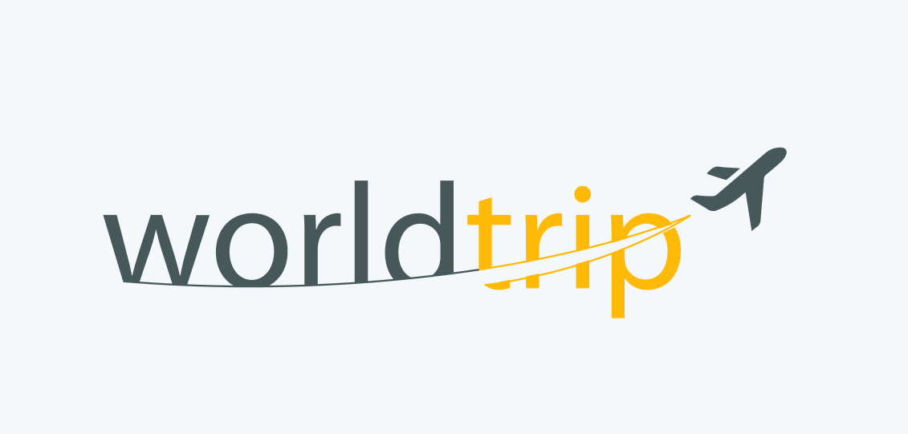
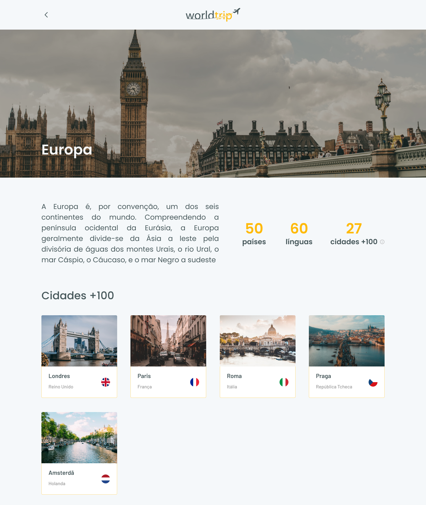
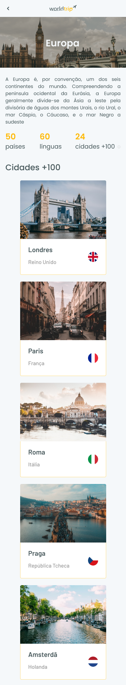
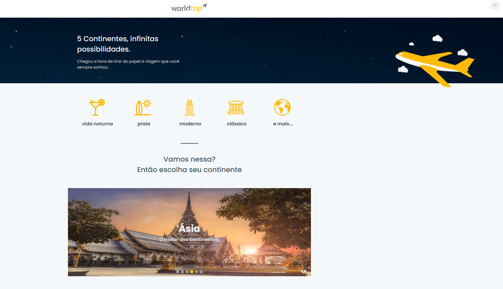
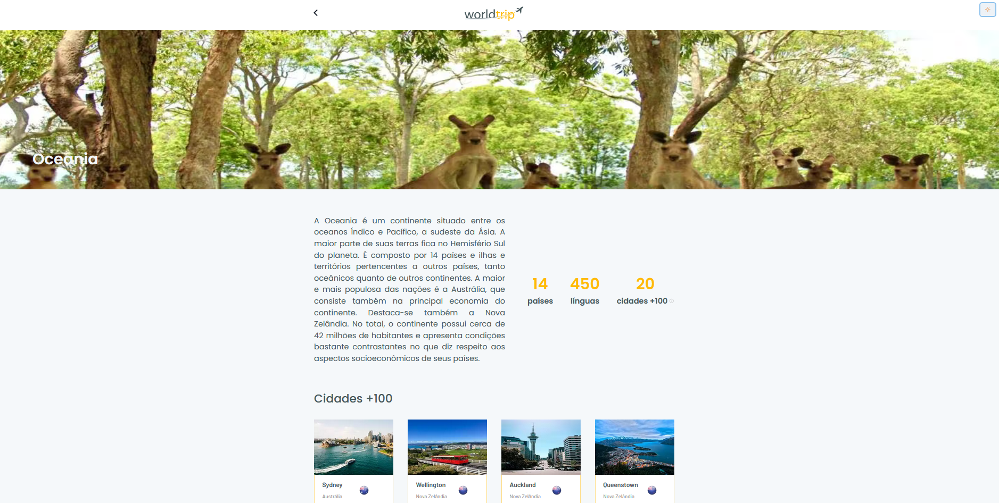

# Desafio 01 - Interface com Chakra UI

<p align="center">



</p>

<br>

<p align="center"><em>Confira o resultado do desafio em: <a href="https://worldtrip-rocketseat-vitor.vercel.app" target="_blank">worldtrip-rocketseat-vitor.vercel.app</a></em></p>

## :computer: Sobre o desafio

<hr>

Nesse desafio, você deverá criar uma aplicação para treinar o que aprendeu até agora no ReactJS

Essa será uma aplicação onde você tem dois objetivos principais. O primeiro é desenvolver toda a interface usando como base o Chakra UI. O outro é que você deve trabalhar o responsivo da aplicação (e é aqui que sua criatividade pode brilhar ainda mais).

Você vai iniciar uma aplicação Next.js do zero na sua própria máquina e implementar a interface conforme o layout do Figma.

A seguir veremos com mais detalhes o que e como precisa ser feito 🚀

## Layout da Aplicação

|              Home              |                 Home Mobile                 |
| :----------------------------: | :-----------------------------------------: |
|  |  |

<br>

|           Continente            |           Continente Mobile           |
| :-----------------------------: | :-----------------------------------: |
|  |  |

## Imagens

<div>
   <p>Home</p>
   
   <br>
   <p>Continente</p>
   
</div>

## :rocket: Techs

<ul>
  <li> ReactJS </li>
  <li> TypeScript </li>
  <li> Next.js </li>
  <li> React Icons </li>
  <li> Prismic </li>
  <li> Sass </li>
  <li> Chakra-UI </li>
</ul>

## Desenvolvimento

---

### Pré-requisitos

- Instalar [Node.js](https://nodejs.org)

- Instalar [Yarn](https://yarnpkg.com/)

### Clone o repositório

```bash
$ git@github.com:vitorgaletti/ignite-reactjs-worldtrip.git
```

### Executar Projeto

```bash
# Mudar para directório
$ cd ignite-reactjs-worldtrip/
```

- Instalar dependências

```bash
$ yarn
```

```bash
# Crie um arquivo .env.local e configure as váriaveis de ambiente
PRISMIC_API_ENDPOINT=
PRISMIC_ACCESS_TOKEN=
```

- Execute

```bash
$ yarn dev
```

```bash
$ yarn build
```

- Executar scripts

|          Ação          |  Utilização  |
| :--------------------: | :----------: |
|   Iniciar o servidor   |  `yarn dev`  |
| Compilar para produção | `yarn build` |

Acesse <http://localhost:3000> para ver o resultado.
